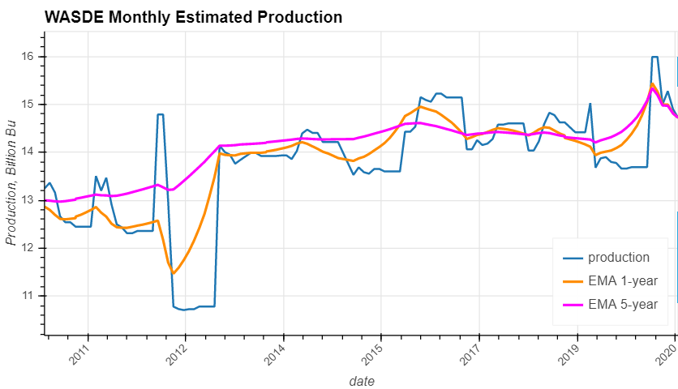
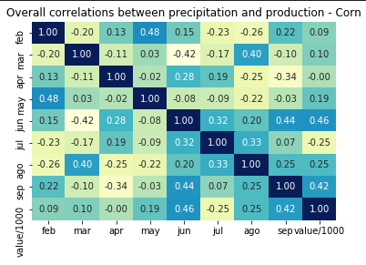
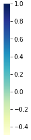
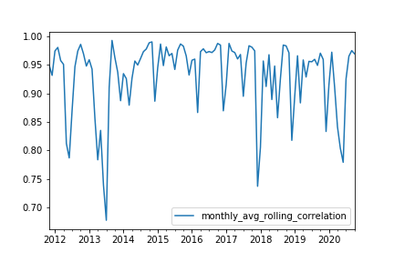
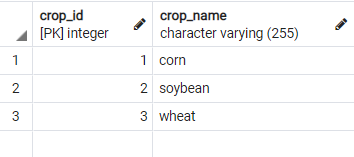
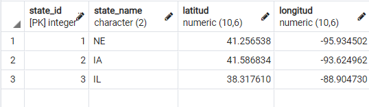

# **Data Farming**
A group project via the Rice University FinTech Bootcamp to demonstrate "FinTech Financial Programming and Quantitative Analysis."

---

## **Table of Contents**
* [General Information](#general-information)
* [Research Questions](#research-questions)
* [Screenshots](#screenshots)
* [Technologies](#technologies)
* [Sources](#sources)
* [Status](#status)
* [Contributors](#contributors)

---

## **General Information**

- Investing in exchange traded funds (ETFs) and futures has advantages while making sure to do the appropriate research and analysis is necessary before making decisions.  This group of contributors wondered if there are any underlying process, commodities, and other factors that might sway specific areas of the futures and ETF markets, so set out on a two week journey to research, analyze and summarize various questions.

    - 1. Is there a relationship between futures market and the respective ETFs on the response to the crops report (i.e.- is one more sensitive than the other)?

    - 2. Is there a correlation between reported crop production vs. expected crop production and futures/ETF pricing?

    - 3. Is Monte Carlo simulation a valid method for predicting the next reported volumes?

- A status and summary of the groups findings are below.

---

## **Research Questions**

### - Is there a relationship between futures market and the respective ETFs on the response to the crops report (i.e.- is one more sensitive than the other)?

- The futures market tends to have more volatility when looking at continuous prompt month pricing for futures, but that is driven by the fact that the ETF is comprised of several futures contracts across tenors.  This dampens volatitily as entire curve structure will shift less than volatility in front which is more sensitive to short lived supply/demand disruptions such as weather.

### - Is there a correlation between reported crop production vs. expected crop production and futures/ETF pricing?

- There appears to be more of a relationship betweeen dislocations in the futures and etf price moves when looking at overall inventory level and inventory level changes then there does with production data points becoming available.  Inventory and production are obviously related, so there is defintely some seasonality because of when get actual production data at year end versus the forecasts throughout the year as go through harvest season.

### - Is Monte Carlo simulation a valid method for predicting the next reported volumes?

- Monte Carlo simulation is a valid method for determining a range of reported volumes, while conducting further analysis on the collected data is needed to determine validity.

---

## Screenshots

* Estimating production data with possible trigger indicators

* 

* Precipitation vs Production

* 

  
   
  

* ETF vs Futures rolling correlation

* 

---
## **Postgress Database and Table Seedings** 
- Weather clean API data was further transfered into Postgress SQL (library psycopg2) to analyze each month temperature and precipitation correlations vs annual corn production.
- These conditions along with corn production tables are accessed via queries from the notebook analy_hcb.ipynb
- To generate tables and seed the data that feed those queries, the following steps need to be performed (in order):
### - Step 1: 
- This step will create a postgresql database named: crop_prod_db in your default PostgreSQL server and it will create 6 tables: crop_name, crop_production_total(note 1),precipitations, states,temperatures and yearly_crop_productions. It consists of two parts:
- Part a: Place postgreSQL user name and password in your environment file. Name the username: POSTGRES_USER_ID, and the password: POSTGRES_PASSWORD.
- Part b: Activate the psycopg2 environment and run the notebook createsqldb.ipynb: After completing this step you would have postgresql database named: crop_prod_db along with the 6 tables mentioned above, and the 2 junction tables (states and crop_name) would be populated.

  
   
  

-It is worth noting that the seeding of the sql table "states" also populates a map chart used in the presentation, which reports states productions.

### - Step 2:
- This step is used to seed the tables temperatures, precipitations and yearly_crop_production with all the information extracted via API from USDA (crop production) and RCCs (weather) sources.    
- To seed the above tables run the jupyter files in psycopg2 environment: temp_sqltable.ipynb (seeds temperatures table), prec_sqltable.ipynb (seeds precipitations table) and crop_y_prod_sqltable.ipynb (seeds the yearly_crop_production table).

note 1: table crop_production_total is intended for future use.

 
---

## **Technologies**

* Python - Version 3.8.5
* VS Code - Version 1.49.1
* Jupyter Notebook - Version 6.1.1
* Windows 10
* Library - calendar
* Library - bokeh
* Library - csv
* Library - datetime
* Library - hvplot.pandas
* Library - json
* Library - matplotlib.pyplot
* Library - numpy
* Library - os
* Library - pandas
* Library - panel
* Library - pathlib
* Library - plotly.express
* Library - pprint
* Library - psycopg2
* Library - python-dotenv
* Library - requests
* Library - seaborn
* Library - sqlalchemy

---

## **Sources**

- https://rice.bootcampcontent.com/Rice-Coding-Bootcamp/rice-hou-fin-pt-09-2020-u-c/blob/master/class/08-Project_1/fintech-projects-collaboration-with-git-v1.0.0.pdf

- http://www.rcc-acis.org/index.html

- https://quickstats.nass.usda.gov/api

- https://usda.library.cornell.edu/concern/publications/3t945q76s?locale=en

- https://www.pnas.org/content/114/35/9326

#### Crop Images Sources:
Crop images used in the project presentation were provided license-free from the following photographers:
- Kelly Sikkema: (https://unsplash.com/photos/yntEERed0SY?utm_source=unsplash&utm_medium=referral&utm_content=creditShareLink)
- Jonathan Brinkhorst: (https://unsplash.com/photos/HoooiiyON4s?utm_source=unsplash&utm_medium=referral&utm_content=creditShareLink)
- Daniel Schludi: (https://unsplash.com/photos/HLOWpeN68G4?utm_source=unsplash&utm_medium=referral&utm_content=creditShareLink)

---

## **Status**

Project is: _In Progress_

---

## **Contributors**

- Carolina Benzaquen
- Jordan Gross
- Jonathan Owens
- Travis Stewart
